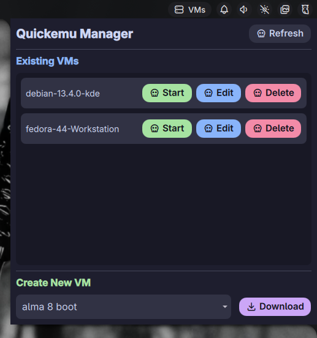

# 🖥️ Quickemu Manager for Noctalia

Welcome to **Quickemu Manager**, a highly polished, native [Noctalia](https://github.com/noctalia-dev/noctalia) shell plugin designed to let you seamlessly manage and create [Quickemu](https://github.com/quickemu-project/quickemu) virtual machines directly from your desktop bar.



---

## ✨ Features

- **🚀 Instant OS Downloads**: Built-in support for downloading over **700+ operating systems** via `quickget`, complete with real-time progress bars.
- **🔍 Filterable OS Search**: No more endless scrolling. The dropdown is fully searchable—type to instantly filter through hundreds of operating systems.
- **🎨 Dynamic Noctalia Theming**: Integrates perfectly with modern Wayland desktop aesthetics. The plugin dynamically syncs with your global Noctalia `Style` and `Color` properties.
- **🛡️ Secure Shell Execution**: Process execution is hardened against command injection and path traversal via strict array-based argument passing.
- **🔄 Background Execution**: Downloads and VM operations run autonomously in the background. You can safely close the widget without interrupting a large download.
- **⚙️ Dynamic Paths**: Automatically resolves paths relative to your home directory, making it portable and easy to use across different setups.

---

## 🛠️ Prerequisites

Ensure you have the following installed and available in your system `$PATH`:
- [`quickemu`](https://github.com/quickemu-project/quickemu)
- [`quickget`](https://github.com/quickemu-project/quickemu)
- `xdg-utils` (for opening config files in your default editor)

---

## 📥 Installation

### Option 1: Noctalia Plugin Hub (Recommended)
You can easily install this via Noctalia's built-in plugin manager or by adding it to your `plugins.json`.

### Option 2: Manual Installation
Install this plugin manually by cloning the repository directly into your Noctalia plugins folder:

```bash
mkdir -p ~/.config/noctalia/plugins
git clone https://github.com/GughNess/quickemu-noctalia-plugin.git ~/.config/noctalia/plugins/quickemu
```

Once cloned:
1. Reload or restart Noctalia (`killall noctalia; noctalia &` or log out and back in).
2. Open your Noctalia settings menu.
3. Enable the `quickemu` plugin and add it to your desired bar section.

---

## ⚙️ Configuration

By default, the plugin stores and looks for your Virtual Machines in `~/quickemu/`. 

If you store your VMs in a different location, you can easily change this directly through the Noctalia plugin settings UI, or by editing the plugin's metadata:

```json
"metadata": {
  "defaultSettings": {
    "vmDirectory": "~/your/custom/directory/"
  }
}
```

---

## 📜 License
This project is licensed under the [MIT License](LICENSE).
